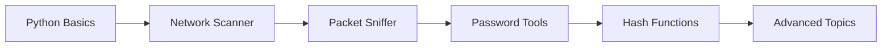

# 🛡️ CEH Practice Tools

<div align="center">


**Interactive Python tools for Certified Ethical Hacker (CEH) practice and learning**

[Features](#-features) • [Installation](#-installation) • [Tools](#-tools) • [Usage](#-usage) • [Learning Path](#-learning-path)

</div>

---

## 📋 About

This repository contains hands-on Python security tools designed for CEH exam preparation and cybersecurity learning. Each tool demonstrates real-world penetration testing concepts in a controlled, educational environment.

> ⚠️ **Disclaimer**: These tools are for educational purposes only. Only use them on systems you own or have explicit permission to test.

## ✨ Features

- 🎯 **Beginner-Friendly**: Well-commented code perfect for learning
- 🔧 **Practical Tools**: Real-world security testing scenarios
- 📚 **CEH Aligned**: Covers key CEH exam domains
- 🚀 **Easy Setup**: Simple installation and usage
- 📖 **Documentation**: Detailed guides for each tool

## 🛠️ Tools

### 1. 🌐 Network Scanner
**File**: `network_scanner.py`
- Discovers active hosts on a network
- Performs port scanning
- Identifies open services
- **CEH Domain**: Scanning Networks

### 2. 🔐 Password Strength Checker
**File**: `password_checker.py`
- Analyzes password complexity
- Provides security recommendations
- Checks against common passwords
- **CEH Domain**: System Hacking

### 3. 📡 Packet Sniffer
**File**: `packet_sniffer.py`
- Captures network traffic
- Analyzes packet headers
- Identifies protocols
- **CEH Domain**: Sniffing

### 4. 🔍 Hash Cracker (Educational)
**File**: `hash_cracker.py`
- MD5/SHA hash demonstration
- Dictionary attack simulation
- Understanding hash vulnerabilities
- **CEH Domain**: Cryptography

## 📥 Installation

### Prerequisites
```bash
# Python 3.8 or higher
python --version
```

### Clone Repository
```bash
git clone https://github.com/ROHITHD300900/CEH-Practice-Tools.git
cd CEH-Practice-Tools
```

### Install Dependencies
```bash
pip install -r requirements.txt
```

## 🚀 Usage

### Quick Start
```bash
# Run Password Checker
python password_checker.py

# Run Network Scanner (requires sudo/admin)
sudo python network_scanner.py

# Run Hash Demonstration
python hash_cracker.py
```

### Example Output
```
🔐 Password Strength Checker
============================
Enter password: ********

Strength: Strong ✓
Score: 8/10

Suggestions:
✓ Length sufficient (12+ characters)
✓ Contains uppercase letters
✓ Contains numbers
! Consider adding special characters
```

## 📚 Learning Path



### Recommended Learning Order:
1. **Start Here**: Password Strength Checker
2. **Network Basics**: Network Scanner
3. **Traffic Analysis**: Packet Sniffer
4. **Cryptography**: Hash Cracker

## 🎓 CEH Exam Domains Covered

| Tool | CEH Domain | Difficulty |
|------|------------|------------|
| Password Checker | System Hacking | Beginner |
| Network Scanner | Scanning Networks | Beginner |
| Packet Sniffer | Sniffing | Intermediate |
| Hash Cracker | Cryptography | Intermediate |

## 🔒 Ethical Guidelines

- ✅ Use only on your own systems
- ✅ Get written permission before testing
- ✅ Document all activities
- ❌ Never use on unauthorized systems
- ❌ Never cause harm or disruption

## 🤝 Contributing

Contributions are welcome! Feel free to:
- Add new security tools
- Improve documentation
- Fix bugs
- Share learning resources

## 📖 Resources

- [EC-Council CEH Official](https://www.eccouncil.org/programs/certified-ethical-hacker-ceh/)
- [OWASP Testing Guide](https://owasp.org/www-project-web-security-testing-guide/)
- [Python Security Libraries](https://pypi.org/search/?q=security)

## 📞 Connect

- **GitHub**: [@ROHITHD300900](https://github.com/ROHITHD300900)
- **LinkedIn**: [Rohith D](https://www.linkedin.com/in/rohith-d-a46aaa288/)

## 📄 License

This project is licensed under the MIT License - see the [LICENSE](LICENSE) file for details.

---

<div align="center">

**⭐ Star this repo if you find it helpful!**

Made with ❤️ for the cybersecurity community

</div>
